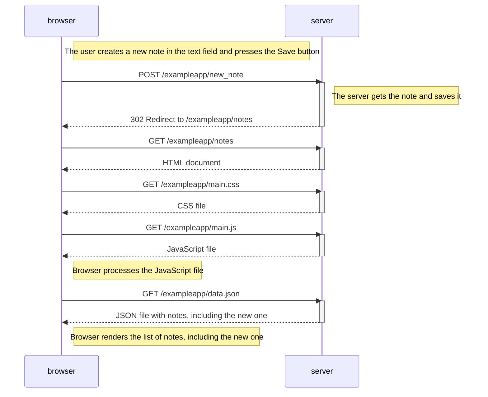

#### 0.4: Diagram of the process of creating a new note

```mermaid
sequenceDiagram
    participant browser
    participant server

    Note right of browser: The user creates a new note in the text field and presses the Save button

    browser->>server: POST /exampleapp/new_note
    activate server
    Note right of server: The server gets the note and saves it
    server-->>browser: 302 Redirect to /exampleapp/notes
    deactivate server

    browser->>server: GET /exampleapp/notes
    activate server
    server-->>browser: HTML document
    deactivate server

    browser->>server: GET /exampleapp/main.css
    activate server
    server-->>browser: CSS file
    deactivate server

    browser->>server: GET /exampleapp/main.js
    activate server
    server-->>browser: JavaScript file
    deactivate server

    Note right of browser: Browser processes the JavaScript file

    browser->>server: GET /exampleapp/data.json
    activate server
    server-->>browser: JSON file with notes, including the new one
    deactivate server

    Note right of browser: Browser renders the list of notes, including the new one
```
