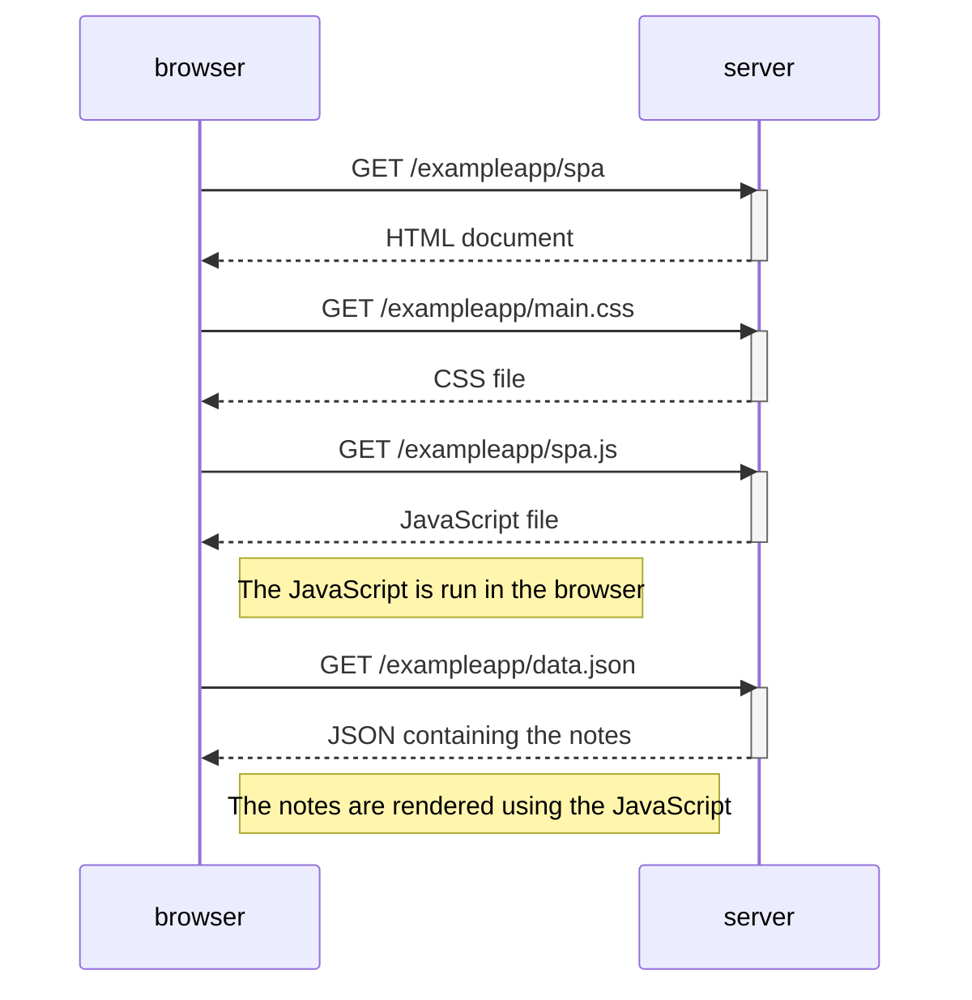

#### 0.5: Diagram of single-page app

```mermaid
sequenceDiagram
    participant browser
    participant server

    browser->>server: GET /exampleapp/spa
    activate server
    server-->>browser: HTML document
    deactivate server

    browser->>server: GET /exampleapp/main.css
    activate server
    server-->>browser: CSS file
    deactivate server

    browser->>server: GET /exampleapp/spa.js
    activate server
    server-->>browser: JavaScript file
    deactivate server

    Note right of browser: The JavaScript is run in the browser

    browser->>server: GET /exampleapp/data.json
    activate server
    server-->>browser: JSON containing the notes
    deactivate server

    Note right of browser: The notes are rendered using the JavaScript
```
